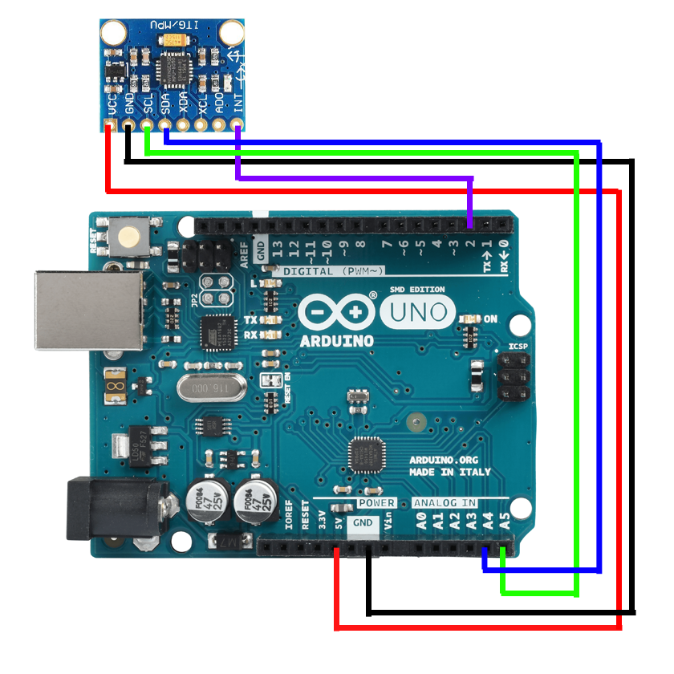

# Hopper
Organizing code for Hopper platform

### Setup

##### Odrive and motor setup
Follow the instructions at https://docs.odriverobotics.com/

Test your setup with calibrate_odrive.py in hopper/src/

##### IMU wiring

##### Install IMU software and calibrate
1. Clone this repo into your local directory (https://github.com/robomechanics/hopper)
2. Install arduino IDE from https://www.arduino.cc/en/main/software
3. Clone I2Cdev into Arduino Library folder (https://github.com/jrowberg/i2cdevlib/tree/master/EFM32/I2Cdev)
4. Clone MPU6050 into Arduino Library folder (https://github.com/jrowberg/i2cdevlib/tree/master/Arduino/MPU6050)
5. Calibrate IMU using MPU6050/examples/IMU_zero/IMU_zero.ino, record offsets
6. cd into hopper repository
7. Open IMU/MPU_6050_calibrated, modify fixed offsets from calibration and download to Arduino
8. `python3 main.py` (check to see that serial port is correct)

### Future plans

Two separate components under development

##### Leg Actuation

Currently developing a single degree of freedom leg with spring in parallel to provide vertical actuation for the hopper. This leg has no role in body control as of now

Simscape model in place, basic optimization loop is functional. For low numbers of free variables this approach works reasonably well, but it looks like we'll need analytical equations of motion to run a full optimization loop in reasonable timescales.

*Tasks*

##### Inertial Control
Under development
